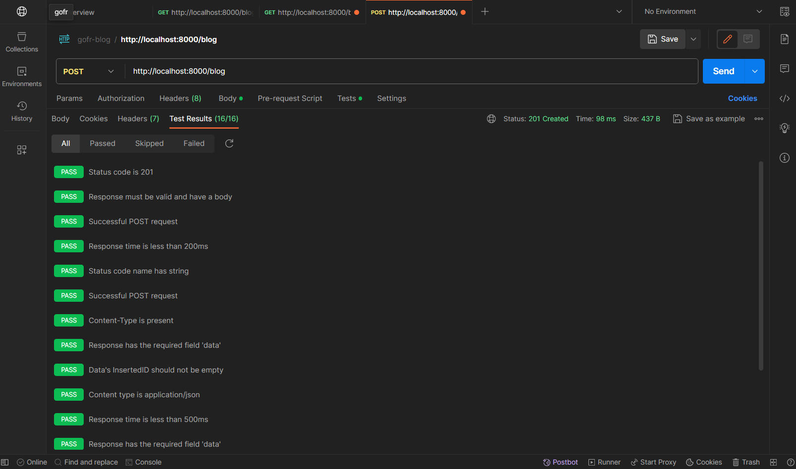

# SBlog Application

## Technology Specification

This blog application is built using the following technologies:

- **Backend:**
  - Language: Go (Golang)
  - Framework: GoFr
  - Database: MongoDB
  - Dependencies: Go Modules

- **Frontend:**
  - HTML, CSS, JavaScript
  - Bootstrap for styling

## Usage

### Create New Blog
Endpoint: `POST /blog`

Create a new blog by providing the title, subtitle, and content.

### Get All Blogs
Endpoint: `GET /blogs`

Retrieve a list of all blogs.

### Get Blog By ID
Endpoint: `GET /blog/{id}`

Retrieve a specific blog by its ID.

### Update Blog By ID
Endpoint: `PUT /blog/{id}`

Update the title, subtitle, and content of a specific blog.

### Delete Blog By ID
Endpoint: `DELETE /blog/{id}`

Delete a specific blog by its ID.

## Postman Collection
[](https://app.getpostman.com/run-collection/31394686-037e2999-fd0f-4d4f-a6c5-76a02c6923a0?action=collection%2Ffork&source=rip_markdown&collection-url=entityId%3D31394686-037e2999-fd0f-4d4f-a6c5-76a02c6923a0%26entityType%3Dcollection%26workspaceId%3D42632939-a688-4bfc-baad-b3f4c2d2d9bf)

## Screenshots

### 1. Create New Blog

Frontend:


Postman Response         | Postman Tests
------------------------- | -------------------------
 | 

### 2. Get All Blogs

Frontend:


Postman Response         | Postman Tests
------------------------- | -------------------------
 | 

### 3. Get Blog By ID

Frontend:


Postman Response         | Postman Tests
------------------------- | -------------------------
 | 

### 4. Update Blog By ID

Frontend:


Postman Response         | Postman Tests
------------------------- | -------------------------
 | 

### 5. Delete Blog By ID

Frontend:


Postman Response         | Postman Tests
------------------------- | -------------------------
 | 

## Sequence Diagram


User Interaction         | System Flow
-------------------------| -------------
 | 


## How to Run

1. **Clone the Project:**
   - Clone the repository using the following command:
     ```bash
     git clone [https://github.com/FadeHack/REST-API]
     ```

2. **Navigate to Project Directory:**
   - Change into the project directory:
     ```bash
     cd REST-API
     ```

3. **Run Backend:**
   - Install Dependencies:
     ```bash
     go mod download
     ```
   - Start the backend server:
     ```bash
     go run main.go
     ```

4. **Run Frontend:**
   - Open a new terminal and navigate to the frontend directory.
   - For local usage, it's recommended to use the "Live Server" extension to run the frontend.


---

*Created by [@FadeHack](https://github.com/FadeHack)*
